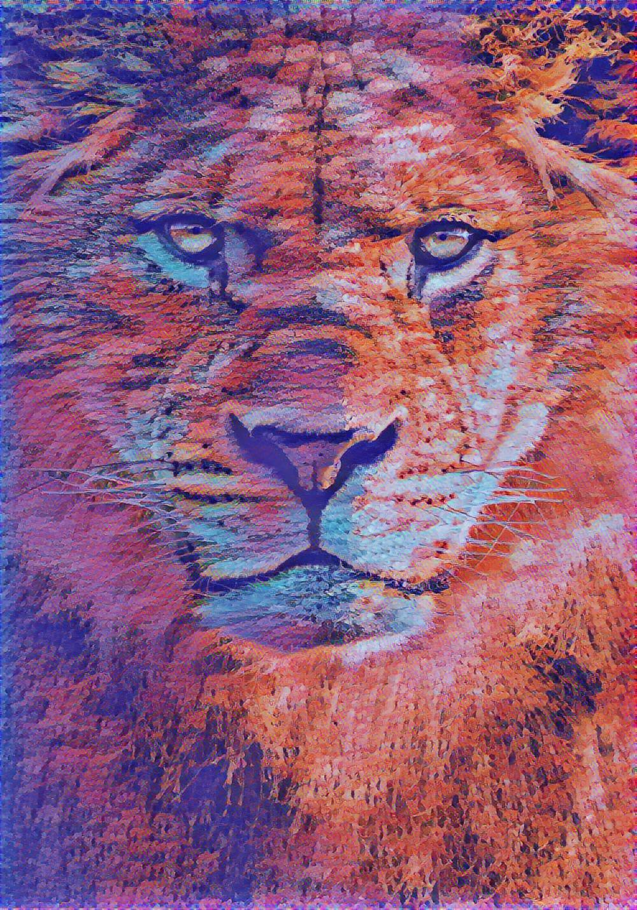

# Neural Style Transfer Project
A deep learning project on Neural Style Transfer implemented using tensorflow_hub. The web application is build using Flask framework, Bootstrap, HTML, CSS, Javascript.

To run the website, run ``` python3 app.py``` in the terminal.
The static folder holds the img, css, javascript folders.
the template folder has all the html files of each webpage which is rendered from the main file **app.py **.

#### Content Image


#### Style Image


#### Final Stylized Image

